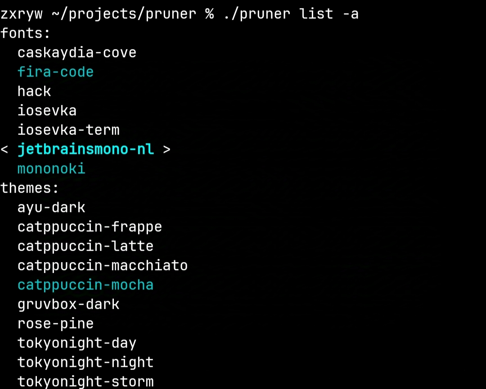

# Pruner 
A Termux tool to easily install Nerd Fonts and themes.

### Preview


## installation and dependencies

Install the following dependencies:
``` sh
pkg add curl jq -y
```

Then clone the repository and enter its directory:
```sh
git clone https://github.com/Y3rw1N/pruner.git
cd pruner
./pruner --help
```
